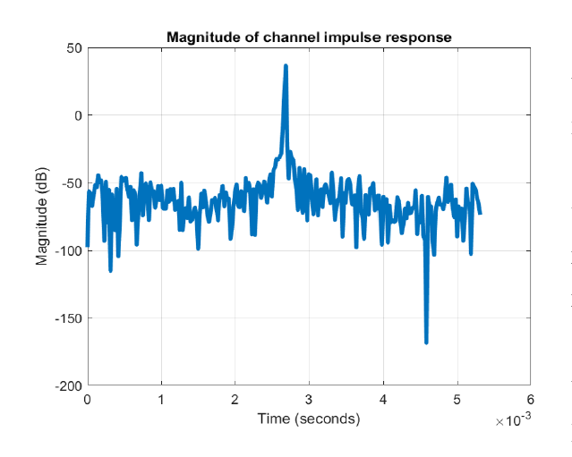

# OFDM Wireless Systems

In this project, we create a simple wireless system by genereting a signal, transmitting it into an acoustic channel using external speakers and receiving ir by an external microphone. The idea is to use the numerous advantages of OFDM (Orthogonal Frequency Division Multipexing), expecially its reduced inter Symbol Interference, in order to improve the results of  Single Carrier System.

A detailed report explaining, the transmitter, the receiver, the channel and the result analysis can be downloaded [here](OFDMReport_EmilioFernandez.pdf). The generated signal is `out.wmv`. In case of not having speakers and/or microphone, the executable `audiotrans.m` can also be run in Bypass mode because the output signal of the transmitter is directly copied into the input of the receiver. 

